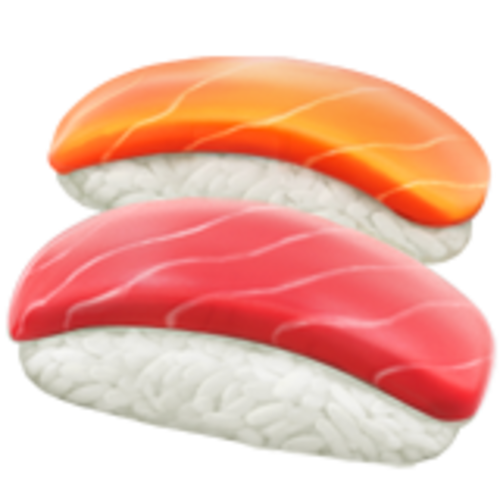
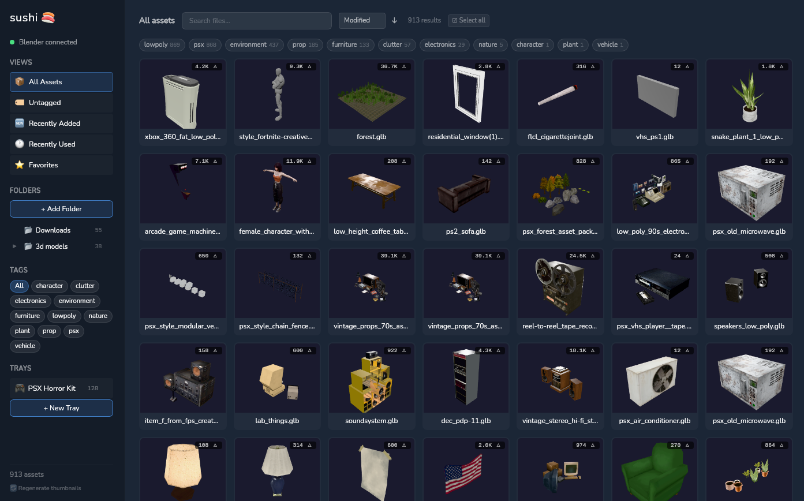
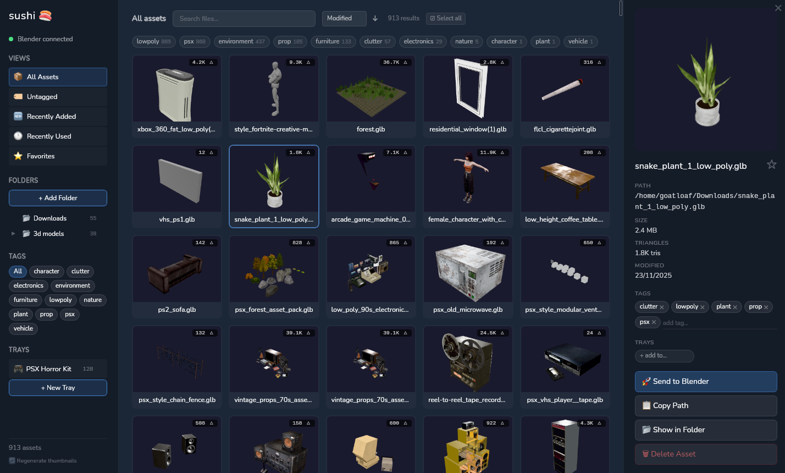

<p align="center">
  
</p>

<h1 align="center">🍣 Sushi</h1>

<p align="center">
  <strong>A fast, lightweight 3D asset manager for your GLB/glTF library.</strong><br/>
  Browse, tag, search, and send assets straight to Blender — all from a beautiful native desktop app.
</p>

<p align="center">
  <a href="#features">Features</a> •
  <a href="#screenshots">Screenshots</a> •
  <a href="#installation">Installation</a> •
  <a href="#blender-addon">Blender Addon</a> •
  <a href="#development">Development</a> •
  <a href="#tech-stack">Tech Stack</a>
</p>

---

<!--
  📸 SCREENSHOTS — Replace these placeholders with actual screenshots!
  Take screenshots of the app and save them to .github/screenshots/
  Then uncomment the images below.
-->

## Screenshots

<p align="center">
  
</p>
<p align="center"><em>Browse your 3D asset library with auto-generated thumbnails</em></p>

<p align="center">
  
</p>
<p align="center"><em>Inspect asset details, tags, polycount, and send to Blender in one click</em></p>

<p align="center">
  
</p>
<p align="center"><em>Select multiple assets for bulk tagging, collections, and export</em></p>

## Features

### 📦 Asset Library

- **Watch folders** — Point Sushi at your asset directories and it auto-indexes every `.glb` and `.gltf` file recursively
- **Auto thumbnails** — 3D previews rendered client-side with Three.js — no external tools needed
- **Polycount display** — Triangle counts extracted automatically during thumbnail generation
- **Folder browser** — Navigate your file tree with a collapsible sidebar folder hierarchy

### 🏷️ Organization

- **Tags** — Create and assign tags to any asset. Bulk-tag hundreds of assets at once
- **Smart tag filtering** — Click to include (blue), right-click to exclude (red). Combine filters freely
- **Trays** — Group assets into named trays with custom icons
- **Search** — Instant filename search across your entire library

### ⚡ Workflow

- **Blender bridge** — One-click import into Blender via the included addon. Sushi detects when Blender is running
- **Bulk selection** — Click, Shift+click range select, Ctrl+click multi-select, or select all
- **Bulk actions** — Tag, add to tray, send to Blender, or delete multiple assets at once
- **Sort by anything** — Name, date added, modified date, file size, or polycount (ascending/descending)

### 🎨 Views & Navigation

- **All Assets** — Your complete library
- **Recently Added** — Latest imports at a glance
- **Favorites** — Star assets you use often
- **Recently Used** — Quick access to assets you've sent to Blender
- **Per-folder browsing** — Filter by watch folder or drill into subfolders

### 🖥️ Native Desktop App

- Built with [Wails](https://wails.io) — native Go backend, no Electron bloat
- Tiny binary (~15 MB), instant startup
- SQLite database — everything stored locally, no cloud, no accounts
- Linux-first (macOS and Windows support via Wails)

## Installation

### Pre-built Binary

Download the latest release from the [Releases](https://github.com/zachmolony/sushi/releases) page.

### Build from Source

**Prerequisites:**

- [Go](https://go.dev/dl/) 1.24+
- [Node.js](https://nodejs.org/) 18+
- [Wails CLI](https://wails.io/docs/gettingstarted/installation) v2

```bash
# Install Wails CLI
go install github.com/wailsapp/wails/v2/cmd/wails@latest

# Clone and build
git clone https://github.com/zachmolony/sushi.git
cd sushi
wails build
```

The binary will be at `build/bin/sushi`.

### Install on Linux

```bash
# Copy binary
cp build/bin/sushi ~/.local/bin/

# Install icon
cp build/appicon.png ~/.local/share/icons/sushi.png

# Create desktop entry
cat > ~/.local/share/applications/sushi.desktop << 'EOF'
[Desktop Entry]
Name=Sushi
Comment=3D Asset Manager
Exec=sushi
Icon=sushi
Type=Application
Categories=Graphics;3DGraphics;Utility;
Terminal=false
EOF
```

## Blender Addon

Sushi includes a lightweight Blender addon that receives assets over a local HTTP bridge.

### Install

1. Open Blender → **Edit** → **Preferences** → **Add-ons** → **Install…**
2. Select `blender/sushi_bridge.py` from this repo
3. Enable **"Import: Sushi Bridge"**

That's it. When the addon is active, Sushi will detect the connection automatically (shown with a 🟢 indicator in the sidebar). Click any asset's **"Send to Blender"** button and it'll appear in your scene.

### How It Works

The addon runs a tiny HTTP server on `127.0.0.1:29877` (local only — nothing leaves your machine). Sushi sends import requests, and the addon calls `bpy.ops.import_scene.gltf()` to bring models into your active Blender scene.

## Data Storage

Everything is stored locally:

| What       | Where                              |
| ---------- | ---------------------------------- |
| Database   | `~/.local/share/sushi/sushi.db`    |
| Thumbnails | `~/.local/share/sushi/thumbnails/` |

No cloud. No telemetry. No accounts. Your files stay yours.

## Development

```bash
# Live development with hot-reload
wails dev

# Frontend only (connects to Go backend at :34115)
cd frontend && npm run dev

# Build production binary
wails build
```

### Project Structure

```
├── main.go              # Wails app entry point
├── app.go               # Go methods exposed to frontend
├── database.go          # SQLite database layer
├── scanner.go           # File system scanner
├── blender_bridge.go    # Blender addon HTTP bridge
├── fileserver.go        # Local file server for thumbnails
├── blender/
│   └── sushi_bridge.py  # Blender addon
└── frontend/
    └── src/
        ├── App.svelte       # Root component
        └── lib/
            ├── actions.ts       # All frontend logic
            ├── stores.ts        # Svelte stores (state)
            ├── thumbnails.ts    # Three.js thumbnail renderer
            ├── Sidebar.svelte   # Folder tree, tags, collections
            ├── AssetGrid.svelte # Main asset grid
            ├── AssetCard.svelte # Individual asset card
            ├── DetailPanel.svelte # Asset detail sidebar
            ├── BulkBar.svelte   # Bulk action toolbar
            ├── FolderTree.svelte  # Recursive folder browser
            └── Toast.svelte     # Notification toasts
```

## Tech Stack

| Layer        | Tech                                                                             |
| ------------ | -------------------------------------------------------------------------------- |
| Backend      | Go 1.24 + [Wails v2](https://wails.io)                                           |
| Frontend     | [Svelte 3](https://svelte.dev) + TypeScript                                      |
| Styling      | [Tailwind CSS 3](https://tailwindcss.com)                                        |
| 3D Rendering | [Three.js](https://threejs.org) (GLTFLoader)                                     |
| Database     | SQLite via [modernc.org/sqlite](https://pkg.go.dev/modernc.org/sqlite) (pure Go) |
| Build        | Vite 3                                                                           |

## License

MIT
