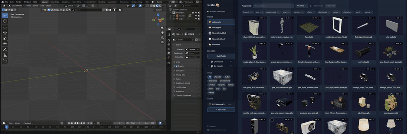

<p align="center">
  
</p>

<h1 align="center">🍣 Sushi</h1>

<p align="center">
  <strong>A fast, lightweight 3D asset manager for your GLB library.</strong><br/>
  Browse, tag, search, and send assets straight to Blender — all from a native desktop app.
</p>

<p align="center">
  <a href="#features">Features</a> •
  <a href="#screenshots">Screenshots</a> •
  <a href="#installation">Installation</a> •
  <a href="#blender-addon">Blender Addon</a> •
  <a href="#development">Development</a> •
  <a href="#tech-stack">Tech Stack</a>
</p>

---

## Screenshots

<p align="center">
  
</p>
<p align="center"><em>Browse your 3D asset library with auto-generated thumbnails</em></p>

<p align="center">
  
</p>
<p align="center"><em>Inspect asset details, tags, polycount, and send to Blender in one click</em></p>

<p align="center">
  
</p>
<p align="center"><em>Select multiple assets for bulk tagging, collections, and export</em></p>

<p align="center">
  
</p>
<p align="center"><em>One-click send to Blender via the included addon</em></p>

## Features

- **Watch folders** — auto-indexes `.glb` and `.gltf` files recursively
- **Auto thumbnails** — 3D previews rendered client-side with Three.js
- **Tags** — stackable tags with smart filtering (click to include, right-click to exclude)
- **Trays** — playlists for 3D assets, like "🎮 PSX Horror Kit" or "🏠 Archviz Kitchen"
- **Blender bridge** — one-click import into Blender via the included addon
- **Bulk actions** — tag, tray, send to Blender, or delete multiple assets at once
- **Sort & search** — by name, date, size, or polycount
- **Views** — All Assets, Recently Added, Favorites, Recently Used, per-folder browsing
- **Native & fast** — ~15 MB binary, SQLite, no cloud, no accounts

## Installation

Download the latest binary from [Releases](https://github.com/zachmolony/sushi/releases), or build from source:

```bash
go install github.com/wailsapp/wails/v2/cmd/wails@latest
git clone https://github.com/zachmolony/sushi.git
cd sushi
make install   # builds and installs to ~/.local/bin with desktop entry
```

> Requires [Go](https://go.dev/dl/) 1.24+, [Node.js](https://nodejs.org/) 18+, and GTK/WebKit dev libraries (`sudo apt install libgtk-3-dev libwebkit2gtk-4.0-dev` on Ubuntu 22.04, or `libwebkit2gtk-4.1-dev` on 24.04+).

## Blender Addon (Sushi Bridge)

Sushi can send assets directly into Blender with one click. To set it up:

1. In Blender, go to **Edit → Preferences → Add-ons → Install…**
2. Select `blender/sushi_bridge.py` from this repo
3. Enable **"Import: Sushi Bridge"**

Once active, a 🟢 indicator appears in Sushi's sidebar. Hit **"Send to Blender"** on any asset and it lands in your scene.

The addon runs a local HTTP server on `127.0.0.1:29877` — nothing leaves your machine.

## Data Storage

All data is local — database at `~/.local/share/sushi/sushi.db`, thumbnails in `~/.local/share/sushi/thumbnails/`. No cloud, no telemetry.

## Development

```bash
wails dev          # live dev with hot-reload
wails build        # production binary
```

## Tech Stack

Go · Svelte · Tailwind CSS · Three.js · SQLite · Vite — built with [Wails](https://wails.io)

## License

MIT
